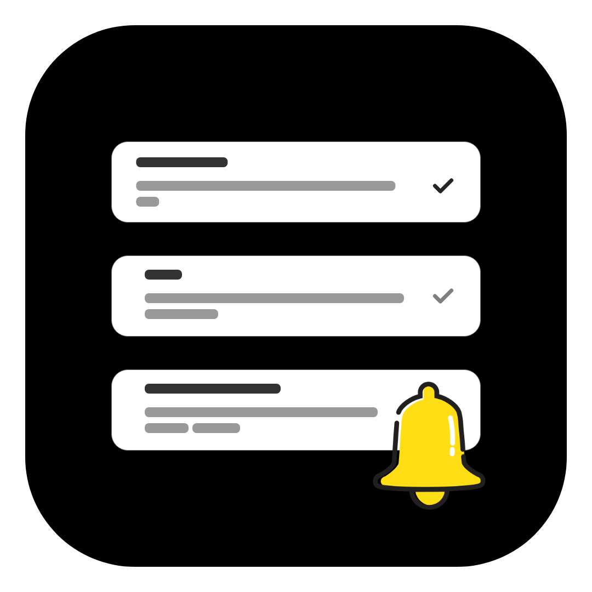
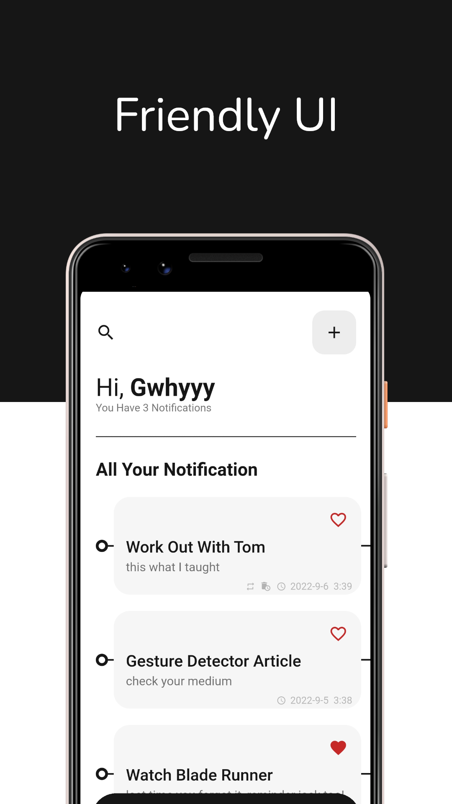

# GNotifier

<a href="https://play.google.com/store/apps/details?id=com.gwhyyy.gnotifier"></a>

Easily create scheduled notifications about anything you don't want to forget to do, watch, learn, listen to...


<br>

# Screenshots
<br>
<br>
<p style="float: left;" align="center" >


<br>
<br>
<br>
<br>


<br>
<br>
<br>
<br>



</p>


# Features
- Light/Dark mode
- Clean friendly UI design
- Notifications control from the app
- Repeat notification daily option
- Auto delete option for notifications
- Add to favorites option with favorites page
- Auto search page
- Possibility to show/hide delete button for your priority notifications
- Possibility to set a notification to be fixed on the notifications bar
- Possibility to hide/show notifications when the phone is locked
- Possibility to delete all notifications at once
- On/off the notification sound
- On/off notification vibration


# Usage
Happy that I see that you want to try it :)

first, clone this project into your machine with : 
```
git clone https://github.com/anasfik/GNotifier.git
```

then open it with your code editor and run : 
```
flutter pub get
```

since like I've say there's no data collected, it doesn't interact with any network database, so don't worry about more configurations

tools used:
Framework: flutter
State management: Getx
local Database: Hive DB


and here you go !


contributing
Hi again, any type of contributions are acceptable and welcome, if you find any issues, word mistakes, bugs, or features to add, just do it
I will be happy to add you in the head of this project

